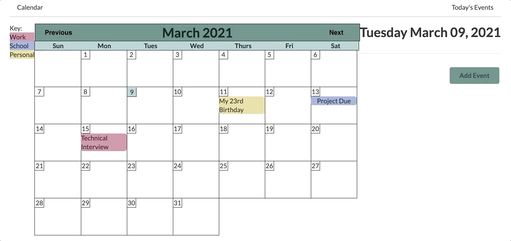
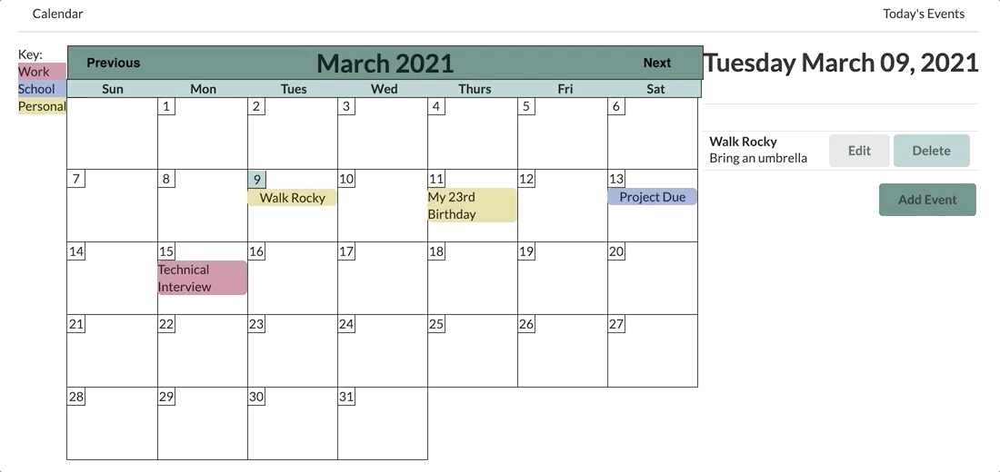

# calendar-react-server

# DEMO

This app allows you to add, edit, delete and view events. The calendar itself is completely responsive to month changes.

**Adding an event.**

**Editing an event.**

**Deleting an event.**

**Viewing a day's events.**

# How to Use the App:

1. Begin by cloning the repository
2. Navigate into the cloned project's directory
3. Navigate into the calendar folder using the command: cd calendar
4. Begin the React app by using the command: npm start
5. Open a second terminal window
6. Navigate into the api folder using the command: cd api
7. Begin the server by using the command: npm start
